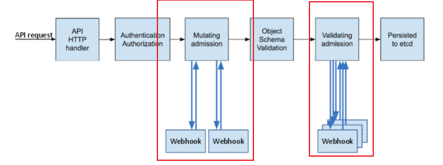

## Kubernetes Admission Controller

Admission Controller는 쿠버네티스 API를 호출했을 때, 해당 요청 내용을 변형(Mutate) 또는 검증(Validate)하는 플러그인의 집합이다.



1. Mutating admission
* http request(yaml 또는 json)을 검사한 후, 적절한 값으로 변경
  * request를 쿠버네티스 관리자가 생성한 webhook server로 보냄 -> 
  * webhook server에서 request 내용 변형 -> 
  * k8s apiserver로 reponse 보냄

2. Validating admission
* http request(yaml 또는 json)을 받아 해당 요청의 생성 가능 여부 확인
  * request를 쿠버네티스 관리자가 생성한 webhook server로 보냄 -> 
  * webhook server에서 request 내용 검증 -> 
  * k8s apiserver로 reponse 보냄

## 전제 조건
* 도커 설치
* 쿠버네티스 클러스터 설치 (버전 1.9 이상)
* 다음 명령어로 출력 확인
  ``` shell
  kubectl api-versions | grep admissionregistration.k8s.io/v1
  ```

## Admission Controller 배포 

폐쇄망의 경우에는 deploy_offline.sh를 외부 인터넷이 활용 가능한 경우에는 deploy_online.sh를 활용한다.
* Online
   ```shell
   # 필요한 경우 쉘스크립트 내부의 변수를 변경해도 된다. (webhook 도커 이미지명, 네임스페이스명)
   sh deploy_online.sh
   ```
1. Webhook Server 도커 이미지 생성
2. Webhook Server에 대한 CA, 인증서, 개인 키 발행 및 쿠버네티스 secret으로 등록
3. Webhook Server Deployment, Service 배포
4. Mutatingwebhookconfigurations 등록

* Offline
   ```shell
   sh deploy_offline.sh
   ```

## 배포 확인

1. Pod 확인
   ```shell
   kubectl get pod -n mutate-server-test
   NAME                                   READY   STATUS    RESTARTS   AGE
   webhook-mutate-server-8ff966d7-8b78d   1/1     Running   0          21h
   ```
2. MutatingWebhookConfiguration 확인
   ```shell
   kubectl get mutatingwebhookconfigurations
   NAME          WEBHOOKS   AGE
   webhook-mwc   1          21h
   ```
3. Example Deployment 배포
   ```shell
   kubectl create -f yaml/example/example-dev-deploy.yaml
   kubectl create -f yaml/example/example-prd-deploy.yaml.
   ```