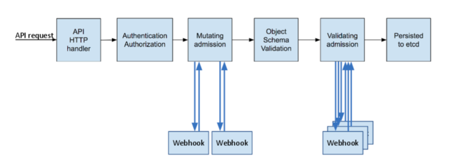

## Kubernetes Admission Controller

Admission Controller는 쿠버네티스 API를 호출했을 때, 해당 요청 내용을 변형(Mutate) 또는 검증(Validate)하는 플러그인의 집합이다.

1. Mutating admission
* http request(yaml 또는 json)을 검사한 후, 적절한 값으로 변경
* 과정 : request를 쿠버네티스 관리자가 생성한 webhook server로 보냄 -> webhook server에서 request 내용 변형 -> k8s apiserver로 reponse 보냄

2. Validating admission
* http request(yaml 또는 json)을 받아 해당 요청의 생성 가능 여부 확인
* 과정 : request를 쿠버네티스 관리자가 생성한 webhook server로 보냄 -> webhook server에서 request 내용 검증 -> k8s apiserver로 reponse 보냄

