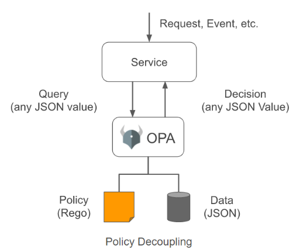

## Open Policy Agent

OPA는 플랫폼 관리자에게 체계적이고 세밀한(fine-graded) 권한관리를 손쉽게 할 수 있는 툴을 제공하는 오픈소스입니다. OPA는 쿠버네티스 뿐만 아니라 OPA 엔진을 이해하는 어떠한 플랫폼 위에서도 동작합니다. OPA는 실제로 요청을 막는 메커니즘은 구현되어 있지 않습니다. 그것은 각 플랫폼마다 다르기 때문에 그 플랫폼의 메커니즘을 그대로 사용합니다. 대신 OPA는 관리자가 작성한 Policy를 읽고 해당 요청을 허용할지 반려할지만을 판단합니다. 각 플랫폼에서는 OPA의 판단 내용을 기반하여 실제 Admission Control 동작을 수행합니다.

### OPA의 이점
* 재컴파일, 재배포 없이 관리자 정책 변경
* 공통된 정책을 다양한 플랫폼에 일관되게 적용
* 정책을 정의하고 유지보수하는 작업을 줄일 수 있음



### OPA 인터페이스
1. input 객체
* 쿠버네티스로부터 전달되는 AdmissionReview 리소스에 대한 전체 정보 담고 있음.
* 정책 관리자는 이 AdmissionReview 객체에 들어 있는 정보를 참조하여 정책 판단.

2. system.main 객체
* system.main 객체의 response 결과에 따라 사용자의 요청 허용 여부 판단.

### Rego Language

OPA는 Rego라는 자체적인 질의 언어(Query Language)를 이용하여 표현합니다.
Rego는 일반적인 imperative 언어와는 다르게 declarative로 동작합니다.

1. 간단한 Deny Rule

모든 Pod의 생성을 막는 정책

```shell
package system

main = {
  "apiVersion": "admission.k8s.io/v1beta1",
  "kind": "AdmissionReview",
  "response": response
}
```

```shell
default response = { "allowed": true }

response = {
    "allowed": false,
    "status": {
        "reason": reason
    }
} {
    reason = concat(", ", deny)
    reason != ""
}
```

imperative 언어로 표현
```shell
response = { "allowed": true };
reason = concat(", ", deny);

if (reason != "") {
    response = {
      "allowed": false,
        "status": {
            "reason": reason
        }
    }
}
```

* 예시
```shell
# main.rego
package system

main = {
  "apiVersion": "admission.k8s.io/v1beta1",
  "kind": "AdmissionReview",
  "response": response
}

default response = { "allowed": true }

response = {
    "allowed": false,
    "status": {
        "reason": reason
    }
} {
    reason = concat(", ", deny)
    reason != ""
}

deny[msg] {
  input.request.operation == "CREATE"
  input.request.kind.kind == "Pod"
  msg := sprintf("Pod is not allowed to be created by %s", [input.request.userInfo.username])
}
```

### 쿠버네티스 환경에 배포

```shell
$ sh create_opa.sh
```

1. OPA 네임스페이스 생성
2. Self-signed 인증서 생성 => Secret 저장
3. Deployment 배포 및 네임스페이스 라벨링
4. main.rego => ConfigMap 저장
5. ValidatingWebhookConfiguration 반영
